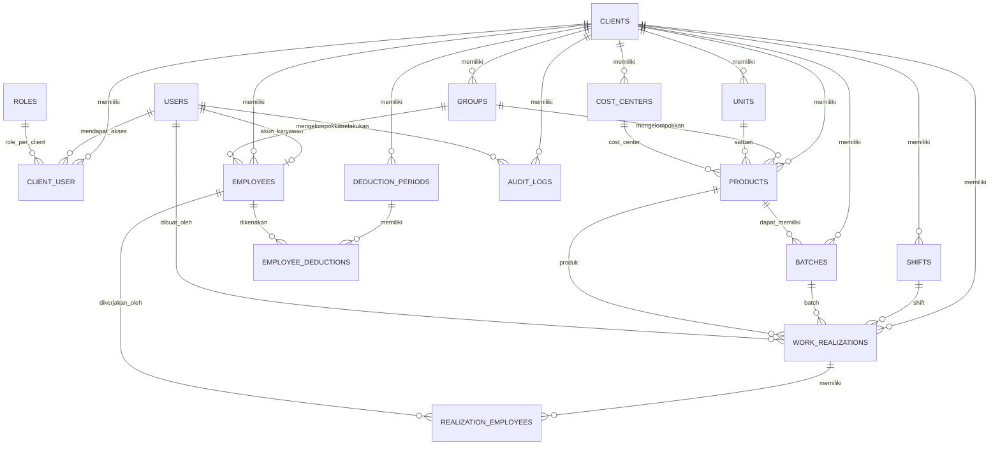

# ERD - KPI Management Co-Packing Multi Client

## 1. Strategi Multi-Client

Menggunakan **shared database + `client_id`** pada data tenant. User dapat memiliki akses ke lebih dari satu client melalui pivot `client_user`.

## 2. ERD Utama



## 3. Tabel dan Kolom

### 3.1 `clients`

| Kolom | Tipe | Catatan |
|---|---|---|
| id | BIGINT PK | |
| code | VARCHAR(50) | unique |
| name | VARCHAR(150) | |
| logo_path | VARCHAR(255) nullable | preview di UI |
| timezone | VARCHAR(50) | default Asia/Jakarta |
| status | VARCHAR(20) | active/inactive |
| created_at | TIMESTAMP | |
| updated_at | TIMESTAMP | |
| deleted_at | TIMESTAMP nullable | soft delete |

Index:

- `UNIQUE(code)`
- `INDEX(status)`

### 3.2 `users`

| Kolom | Tipe | Catatan |
|---|---|---|
| id | BIGINT PK | |
| name | VARCHAR(150) | |
| username | VARCHAR(100) | unique |
| email | VARCHAR(150) nullable | unique bila diisi |
| avatar_path | VARCHAR(255) nullable | avatar user, opsional |
| password | VARCHAR(255) | hash |
| is_super_admin | BOOLEAN | default false |
| status | VARCHAR(20) | active/inactive |
| last_login_at | TIMESTAMP nullable | |
| created_at | TIMESTAMP | |
| updated_at | TIMESTAMP | |

### 3.3 `roles`

| Kolom | Tipe |
|---|---|
| id | BIGINT PK |
| code | VARCHAR(50) unique |
| name | VARCHAR(100) |
| description | VARCHAR(255) nullable |

Jika permission granular dibutuhkan, gunakan tabel `permissions` dan `role_permission`, atau package permission yang disetujui tim.

### 3.4 `client_user`

| Kolom | Tipe | Catatan |
|---|---|---|
| id | BIGINT PK | |
| client_id | BIGINT FK | |
| user_id | BIGINT FK | |
| role_id | BIGINT FK | role dapat berbeda per client |
| is_default | BOOLEAN | |
| status | VARCHAR(20) | |

Index:

- `UNIQUE(client_id, user_id)`
- `INDEX(user_id, status)`
- `INDEX(client_id, role_id)`

### 3.5 `groups`

| Kolom | Tipe |
|---|---|
| id | BIGINT PK |
| client_id | BIGINT FK |
| code | VARCHAR(50) nullable |
| name | VARCHAR(100) |
| status | VARCHAR(20) |
| timestamps | TIMESTAMP | 

Index:

- `UNIQUE(client_id, code)` bila code diwajibkan.
- `INDEX(client_id, status)`

### 3.6 `units`

| Kolom | Tipe |
|---|---|
| id | BIGINT PK |
| client_id | BIGINT FK |
| code | VARCHAR(30) |
| name | VARCHAR(50) |
| status | VARCHAR(20) |

Index: `UNIQUE(client_id, code)`.

### 3.7 `cost_centers`

| Kolom | Tipe |
|---|---|
| id | BIGINT PK |
| client_id | BIGINT FK |
| code | VARCHAR(50) |
| name | VARCHAR(100) |
| status | VARCHAR(20) |

Index: `UNIQUE(client_id, code)`.

### 3.8 `shifts`

| Kolom | Tipe |
|---|---|
| id | BIGINT PK |
| client_id | BIGINT FK |
| code | VARCHAR(30) |
| name | VARCHAR(100) |
| start_time | TIME |
| end_time | TIME |
| status | VARCHAR(20) |

Index:

- `UNIQUE(client_id, code)`
- `INDEX(client_id, status)`

### 3.9 `employees`

| Kolom | Tipe | Catatan |
|---|---|---|
| id | BIGINT PK | internal PK |
| user_id | BIGINT FK nullable | akun login karyawan, maksimal satu karyawan per user |
| client_id | BIGINT FK | tenant |
| employee_no | VARCHAR(9) | generated 9 digit |
| sim_id | VARCHAR(100) nullable | |
| full_name | VARCHAR(150) | |
| email | VARCHAR(150) nullable | |
| phone | VARCHAR(30) | |
| join_date | DATE | |
| gender | VARCHAR(20) | |
| employee_status | VARCHAR(50) | |
| marital_status | VARCHAR(30) | |
| group_id | BIGINT FK nullable | |
| rate_category | VARCHAR(10) | `lama`/`baru` |
| status | VARCHAR(20) | active/inactive |
| created_at | TIMESTAMP | |
| updated_at | TIMESTAMP | |
| deleted_at | TIMESTAMP nullable | |

Index:

- `UNIQUE(client_id, employee_no)`
- `UNIQUE(user_id)` bila akun karyawan ditautkan
- `INDEX(client_id, sim_id)`
- `INDEX(client_id, full_name)`
- `INDEX(client_id, group_id, status)`
- `INDEX(client_id, join_date)`

Catatan login:

- `users` adalah tabel akun login untuk seluruh tipe pengguna.
- Akun client mendapat akses melalui `client_user` dengan role `client-viewer` atau role lain sesuai kebijakan.
- Akun karyawan ditautkan ke `employees.user_id` dan tetap wajib memiliki mapping `client_user` aktif untuk menentukan client serta role.
- `users.avatar_path` nullable; akun tetap valid tanpa avatar.

### 3.10 `products`

| Kolom | Tipe |
|---|---|
| id | BIGINT PK |
| client_id | BIGINT FK |
| sku | VARCHAR(100) |
| name | VARCHAR(180) |
| unit_id | BIGINT FK |
| group_id | BIGINT FK nullable |
| cost_center_id | BIGINT FK nullable |
| po_price | BIGINT UNSIGNED default 0 | rupiah utuh |
| old_employee_rate | DECIMAL(18,3) default 0 |
| new_employee_rate | DECIMAL(18,3) default 0 |
| estimated_output_per_hour | INT nullable |
| status | VARCHAR(20) |
| timestamps | TIMESTAMP |
| deleted_at | TIMESTAMP nullable |

Index:

- `UNIQUE(client_id, sku)`
- `INDEX(client_id, name)`
- `INDEX(client_id, status)`
- `INDEX(client_id, group_id, status)`
- `INDEX(client_id, cost_center_id)`

### 3.11 `batches`

| Kolom | Tipe |
|---|---|
| id | BIGINT PK |
| client_id | BIGINT FK |
| batch_no | VARCHAR(100) |
| product_id | BIGINT FK nullable |
| start_date | DATE nullable |
| end_date | DATE nullable |
| status | VARCHAR(20) |

Index:

- `UNIQUE(client_id, batch_no)`
- `INDEX(client_id, product_id, status)`

### 3.12 `work_realizations`

| Kolom | Tipe | Catatan |
|---|---|---|
| id | BIGINT PK | |
| client_id | BIGINT FK | |
| work_date | DATE | tanggal borongan |
| shift_id | BIGINT FK | |
| batch_id | BIGINT FK nullable | |
| product_id | BIGINT FK | |
| sku_snapshot | VARCHAR(100) | histori |
| product_name_snapshot | VARCHAR(180) | histori |
| unit_name_snapshot | VARCHAR(50) | histori |
| total_output | DECIMAL(18,3) | karton/kg |
| start_time | TIME | |
| end_time | TIME | |
| report | TEXT nullable | |
| is_complaint | BOOLEAN | |
| status | VARCHAR(20) | draft/final/cancelled |
| created_by | BIGINT FK users | |
| finalized_by | BIGINT FK users nullable | |
| finalized_at | TIMESTAMP nullable | |
| timestamps | TIMESTAMP | |

Index:

- `INDEX(client_id, work_date)`
- `INDEX(client_id, work_date, status)`
- `INDEX(client_id, product_id, work_date)`
- `INDEX(client_id, shift_id, work_date)`
- `INDEX(client_id, is_complaint, work_date)`

### 3.13 `realization_employees`

Pivot ini penting untuk histori rate dan perhitungan gaji.

| Kolom | Tipe |
|---|---|
| id | BIGINT PK |
| work_realization_id | BIGINT FK |
| employee_id | BIGINT FK |
| rate_category_snapshot | VARCHAR(10) |
| rate_per_unit_snapshot | DECIMAL(18,3) |
| allocation_output | DECIMAL(18,3) nullable |
| gross_amount | BIGINT UNSIGNED default 0 | rupiah utuh |
| created_at | TIMESTAMP |

Index:

- `UNIQUE(work_realization_id, employee_id)`
- `INDEX(employee_id, work_realization_id)`

**Catatan:** `allocation_output` dan formula `gross_amount` menunggu keputusan business rule pembagian hasil ketika satu realisasi memiliki beberapa karyawan.

### 3.14 `deduction_periods`

| Kolom | Tipe |
|---|---|
| id | BIGINT PK |
| client_id | BIGINT FK |
| month | DATE | simpan tanggal pertama bulan |
| week_no | TINYINT nullable |
| status | VARCHAR(20) | draft/locked |
| created_by | BIGINT FK users |
| locked_by | BIGINT FK users nullable |
| locked_at | TIMESTAMP nullable |
| timestamps | TIMESTAMP |

Index:

- `UNIQUE(client_id, month, week_no)` sesuai handling NULL di DB/application.
- `INDEX(client_id, month, status)`

### 3.15 `employee_deductions`

| Kolom | Tipe |
|---|---|
| id | BIGINT PK |
| deduction_period_id | BIGINT FK |
| employee_id | BIGINT FK |
| uniform_amount | BIGINT UNSIGNED | rupiah utuh |
| equipment_amount | BIGINT UNSIGNED | rupiah utuh |
| meal_amount | BIGINT UNSIGNED | rupiah utuh |
| bpjs_health_percent | DECIMAL(8,3) |
| bpjs_employment_percent | DECIMAL(8,3) |
| salary_advance_type | VARCHAR(20) nullable |
| salary_advance_value | DECIMAL(18,3) | amount jika fixed, persentase jika percentage |
| correction_minus | BIGINT UNSIGNED | rupiah utuh |
| correction_plus | BIGINT UNSIGNED | rupiah utuh |
| notes | TEXT nullable |
| timestamps | TIMESTAMP |

Index:

- `UNIQUE(deduction_period_id, employee_id)`
- `INDEX(employee_id, deduction_period_id)`

### 3.16 `audit_logs`

| Kolom | Tipe |
|---|---|
| id | BIGINT PK |
| client_id | BIGINT nullable |
| user_id | BIGINT nullable |
| action | VARCHAR(50) |
| auditable_type | VARCHAR(150) |
| auditable_id | BIGINT nullable |
| old_values | JSON nullable |
| new_values | JSON nullable |
| ip_address | VARCHAR(45) nullable |
| user_agent | TEXT nullable |
| created_at | TIMESTAMP |

Index:

- `INDEX(client_id, created_at)`
- `INDEX(user_id, created_at)`
- `INDEX(auditable_type, auditable_id)`
- `INDEX(action, created_at)`

## 4. Tabel Opsional untuk Performa Payroll Besar

Jika jumlah data realisasi sangat besar dan laporan payroll sering dibuka, tambahkan snapshot payroll:

- `payroll_runs`
- `payroll_details`

Data dihitung saat periode difinalisasi sehingga laporan tidak perlu melakukan agregasi jutaan baris setiap kali dibuka.

## 5. Aturan Tenant Scope

Contoh konsep:

```php
Employee::query()
    ->where('client_id', currentClientId())
    ->with(['group:id,name'])
    ->select(['id', 'client_id', 'employee_no', 'full_name', 'group_id', 'status']);
```

Jangan menggunakan `client_id` dari request sebagai sumber kebenaran tanpa validasi akses user.

## 6. Aturan Eager Loading

Gunakan eager loading hanya untuk relasi yang benar-benar dibutuhkan.

```php
WorkRealization::query()
    ->where('client_id', currentClientId())
    ->with([
        'product:id,sku,name',
        'shift:id,name',
        'batch:id,batch_no',
        'employees:id,employee_no,full_name',
    ]);
```

Hindari:

- `Model::all()` pada data besar.
- Load seluruh relasi tanpa select kolom.
- Query relasi di dalam loop.

## 7. Indexing Checklist

Setiap tabel tenant minimal memiliki index:

- `client_id`
- foreign key utama
- kolom status
- kolom tanggal yang sering difilter

Composite index disesuaikan pola query, bukan dibuat berlebihan.

Contoh paling penting:

```text
employees              (client_id, status)
employees              (client_id, group_id, status)
products               (client_id, status)
products               (client_id, sku) UNIQUE
work_realizations      (client_id, work_date, status)
work_realizations      (client_id, product_id, work_date)
work_realizations      (client_id, shift_id, work_date)
audit_logs             (client_id, created_at)
deduction_periods      (client_id, month, status)
```

## 8. Penguatan ERD untuk Integritas dan Keamanan

Bagian ini merupakan perluasan desain dan harus dikonsolidasikan dalam migration sebelum implementasi baru. Jangan mengubah schema production yang sudah digunakan tanpa migration, pemeriksaan data existing, backup, dan rollback plan.

### 8.1 Tenant ownership pada tabel detail

Tambahkan `client_id` pada tabel detail yang membutuhkan isolasi berlapis, termasuk `realization_employees` dan `employee_deductions`; untuk snapshot payroll, export jobs, dan file metadata, ownership tenant juga wajib eksplisit. Pertahankan `id` sebagai primary key internal bila diperlukan ORM.

Gunakan composite constraint untuk memastikan child dan parent berada pada tenant yang sama. Contoh konsep:

```text
work_realizations: UNIQUE(client_id, id)
employees: UNIQUE(client_id, id)
realization_employees:
  client_id NOT NULL
  FK(client_id, work_realization_id) -> work_realizations(client_id, id)
  FK(client_id, employee_id) -> employees(client_id, id)
  UNIQUE(work_realization_id, employee_id)

deduction_periods: UNIQUE(client_id, id)
employee_deductions:
  client_id NOT NULL
  FK(client_id, deduction_period_id) -> deduction_periods(client_id, id)
  FK(client_id, employee_id) -> employees(client_id, id)
```

Terapkan pola serupa pada `products.unit_id`, `products.group_id`, `products.cost_center_id`, `batches.product_id`, dan seluruh relasi tenant lainnya sesuai kebutuhan. Constraint harus didukung versi/engine database yang disetujui; jalankan migration dan integration test pada engine production. Index redundant harus dievaluasi, bukan ditambahkan tanpa analisis.

### 8.2 User/role dan session

`client_user` tetap memungkinkan satu user memiliki beberapa client dengan satu role utama per client. Jika satu user memerlukan beberapa role dalam satu client, buat pivot `client_user_roles` atau struktur permission yang disetujui; jangan menggandakan mapping yang melanggar unique constraint. Tabel `permissions` dan `role_permission` diselesaikan bila granular permissions diperlukan. Role dan permission global dibedakan dari role client, dan perubahan privilege harus diaudit.

Gunakan session storage dan password reset/token tables standar Laravel atau mekanisme yang didukung. Tambahkan metadata MFA dan session revocation hanya setelah metode auth dipilih. Jangan menyimpan recovery code atau token plaintext; gunakan proteksi yang sesuai sifat secret-nya.

### 8.3 Tabel keamanan/operasional yang direkomendasikan

| Tabel | Kolom inti | Tujuan |
|---|---|---|
| `security_events` | id, client_id nullable, actor_id nullable, event_type, outcome, reason_code, request_id, ip_address, occurred_at | Log keamanan terstruktur dan pencarian insiden. |
| `export_jobs` | id, client_id, requested_by, report_type, filters_json, status, file_path, expires_at, created_at | Ownership dan lifecycle export privat. |
| `stored_files` | id, client_id, uploaded_by, disk, path, mime_type, size, checksum, status, created_at | Metadata file, akses privat, validasi ownership. |
| `payroll_runs` | id, client_id, period_id, version, status, finalized_by, finalized_at, timestamps | Snapshot dan versi run payroll. |
| `payroll_details` | id, client_id, payroll_run_id, employee_id, gross_amount, deductions_amount, net_amount, timestamps | Detail snapshot finansial yang dapat ditelusuri. |
| `idempotency_keys` | id, client_id, actor_id, action, key_hash, request_hash, status, response_reference, expires_at | Mencegah proses ulang aksi kritis. |

Tabel di atas adalah rancangan usulan, bukan kewajiban menambah semua tabel jika package/infra resmi sudah menyediakan kontrol setara. Tetapkan tipe, unique key, FK, retensi, dan index sesuai query nyata. Data sensitif dalam `filters_json`, metadata, atau audit harus dibatasi dan direduksi.

### 8.4 Audit log dan data pribadi

Tabel `audit_logs` yang telah dirancang dapat dipertahankan, tetapi `old_values`/`new_values` harus menggunakan redaction allowlist. Tambahkan `request_id`, `outcome`, `reason_code`, dan `occurred_at` bila diperlukan. Jangan menyimpan password, token, session ID, secret, atau dump data gaji lengkap secara otomatis. Akses dan retensi audit mengikuti kebijakan perusahaan.

### 8.5 Index dan data integrity

- Index security_events: `(client_id, occurred_at)` dan `(event_type, occurred_at)` sesuai kebutuhan.
- Export jobs: `(client_id, requested_by, created_at)` dan `(status, expires_at)` untuk lifecycle/cleanup.
- Stored files: `(client_id, id)` serta indeks ownership yang sesuai; path harus unik sesuai strategi storage.
- Payroll: unique `(client_id, period_id, version)` dan unique `(payroll_run_id, employee_id)` sesuai business rule final.
- Idempotency: unique scope aksi/client/key yang ditentukan, dengan expiry dan penyimpanan hasil yang aman.
- Jangan melakukan index pada seluruh JSON atau field pribadi tanpa kebutuhan query dan penilaian keamanan.
- Semua constraint dan migration perlu test duplicate key, cross-tenant FK, referential integrity, dan rollback.
